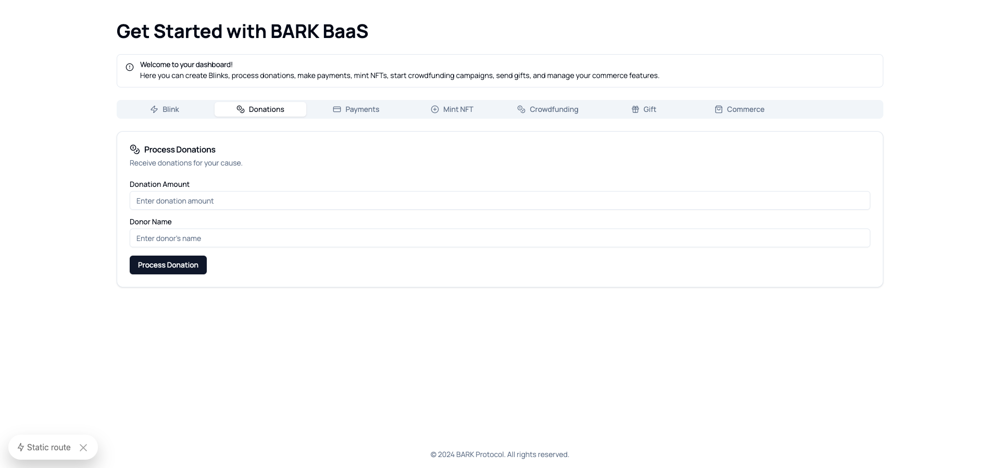

# BARK BaaS Platform

**Solana-based blockchain as a service platform built by BARK Protocol**


## Overview

The BARK BaaS Platform is a scalable, Solana-powered solution for building decentralized applications, with features like wallet integration, blinks, token management, staking mechanisms, and NFT minting. It comes with a robust API and a user-friendly interface to streamline blockchain interactions.

## Use Cases



## Tech Stack

- **Framework**: [Next.js](https://nextjs.org/)
- **Database**: [Postgres](https://www.postgresql.org/)
- **ORM**: [Drizzle](https://orm.drizzle.team/)
- **Payments**: [Stripe](https://stripe.com/)
- **UI Library**: [shadcn/ui](https://ui.shadcn.com/)
- **Blockchain**: [Solana](https://solana.com/)
- **Smart Contract Framework**: [Anchor](https://www.anchor-lang.com/)
- **Wallet Integration**: [@solana/wallet-adapter](https://github.com/solana-labs/wallet-adapter)
- **Solana Web3 Library**: [@solana/web3.js](https://solana-labs.github.io/solana-web3.js/)
- **State Management**: [Zustand](https://github.com/pmndrs/zustand)
- **API Layer**: [tRPC](https://trpc.io/)
- **Authentication**: [NextAuth.js](https://next-auth.js.org/)
- **Styling**: [Tailwind CSS](https://tailwindcss.com/)
- **Deployment**: [Vercel](https://vercel.com/)
- **Testing**: [Jest](https://jestjs.io/) and [React Testing Library](https://testing-library.com/docs/react-testing-library/intro/)
- **Linting**: [ESLint](https://eslint.org/)
- **Code Formatting**: [Prettier](https://prettier.io/)

## Getting Started

### 1. Clone the repository

```bash
git clone https://github.com/your-username/bark-baas-platform.git
```

### 2. Navigate to the project directory:

```bash
cd bark-baas-platform
```

### 3. Install dependencies:

```bash
pnpm install
```

### 4. Set up environment variables:

- Copy the `.env.example` file to `.env`.
- Fill in the required values in the `.env` file.

## Running Locally

Use the included setup script to create your `.env` file and set up the database:

```bash
pnpm db:setup
```

Then, run the database migrations and seed the database with a default user and team:

```bash
pnpm db:migrate
pnpm db:seed
```

This will create the following credentials:

- **User**: `test@test.com`
- **Password**: `admin123`

You can create new users via the `/sign-up` route.

### 5. Start the development server:

```bash
pnpm dev
```

Open [http://localhost:3000](http://localhost:3000) to see the app in action.

## Testing Payments

To test Stripe payments, use the following card details:

- **Card Number**: `4242 4242 4242 4242`
- **Expiration**: Any future date.
- **CVC**: Any 3-digit number.

You can listen for Stripe webhooks locally via their CLI:

```bash
stripe listen --forward-to localhost:3000/api/stripe/webhook
```

## Going to Production

### 1. Set up a production Stripe webhook

1. Go to the Stripe Dashboard and create a new webhook.
2. Set the endpoint URL to your production API route (e.g., `https://yourdomain.com/api/stripe/webhook`).
3. Select events like `checkout.session.completed` and `customer.subscription.updated`.

### 2. Deploy to Vercel

1. Push your code to GitHub.
2. Connect your repository to Vercel and deploy it.
3. Add environment variables in Vercel's project settings:
    - `BASE_URL`: Your production domain.
    - `STRIPE_SECRET_KEY`: Your production Stripe secret key.
    - `STRIPE_WEBHOOK_SECRET`: The webhook secret for Stripe.
    - `POSTGRES_URL`: Production PostgreSQL database URL.
    - `AUTH_SECRET`: Generate using `openssl rand -base64 32`.

### Docker

To build and run Docker image:

1. Build the image:

```
docker build -t bark-baas-platform .
```

2. Run the container:

```
docker run -p 3000:3000 bark-baas-platform
```

## Usage

For detailed usage instructions and API documentation, visit the [official documentation](https://docs.barkprotocol.com).

Here’s a refined version of your **To-Do** list with suggestions for each item:

## To-Do

### **1. Implement Platform e.g. blinkboard (Payment Version)**

**Proof of Concept**: 
- Clone the repository for the Blinkboard:  
  `git clone https://github.com/barkprotocol/blinkboard`

**Objective**:  
Create a **payment-enabled Blinkboard** that facilitates BARK transactions and user interactions.

**Steps**:
1. **Payment Gateway Integration**:
   - Integrate **Stripe** for fiat or **Solana Pay** for crypto transactions.
   - Provide options for both payment methods (optional, depending on user needs).
  
2. **Transaction Tracking**:
   - Implement a **transaction history** feature for tracking and displaying past payments.
   - Ensure each transaction is linked to a user’s profile.

3. **Real-Time Updates**:
   - Enable **real-time account balance updates** after each transaction.
   - Display **transaction status** (pending, complete, failed) in the user interface.

4. **Security**:
   - Implement **payment security measures** (tokenized payment data, encryption, and key management).
   - Use secure transaction signing (if using Solana Pay).

5. **Test Environments**:
   - Test payments in both **testnet** and **mainnet** environments for Solana (or Stripe sandbox for fiat).
   
6. **UI/UX**:
   - Develop **user-friendly UI** for processing payments, with clear instructions, notifications, and error handling.

**Outcome**:  
A fully integrated **Blinkboard** with secure and trackable payment functionalities, allowing users to make transactions within the BARK ecosystem.

---

### **2. Create Blink Application (Get-Started Module), Basic Features**

**Objective**:  
Build a **Get Started** module for onboarding new users into the Blink system.

**Steps**:
1. **Onboarding Flow**:
   - Design a **multi-step onboarding process** guiding users through wallet connection, profile setup, and first transaction.

2. **Step-by-Step Guide**:
   - Implement a guide to help users **mint NFTs**, **claim airdrops**, or **stake tokens**.
   
3. **Interactive Dashboard**:
   - Provide a dashboard with essential actions (e.g., **view NFTs**, **stake tokens**, **claim rewards**).

4. **Educational Component**:
   - Include brief **tutorials or tooltips** explaining the main features (e.g., staking, rewards, and BARK ecosystem benefits).

5. **Wallet Integration**:
   - Seamlessly integrate with **Phantom**, **Solflare**, and **Backpack** wallets for streamlined user access.

6. **Responsive Design**:
   - Ensure the **module is fully responsive**, optimized for both desktop and mobile users.

**Outcome**:  
A streamlined **Get Started module** that educates and enables new users to begin using Blink features, such as minting, staking, and exploring the ecosystem.

---

### **3. Create Modular Pages**

**Objective**:  
Design flexible, reusable **modular pages** to enhance the scalability and ease of development for future updates.

**Steps**:
1. **Modular Page Template**:
   - Create a **page template** that can be repurposed for sections like the marketplace, staking, or dashboards.

2. **Reusable Components**:
   - Build **reusable UI components** (cards, modals, forms) that can be customized and deployed across different sections.

3. **Dynamic Routing**:
   - Set up **dynamic routing** to support multiple pages, such as `/dashboard`, `/marketplace`, and `/staking`.

4. **Lazy Loading**:
   - Implement **lazy loading** to improve page load times, only rendering necessary components for each section.

5. **Scalability**:
   - Ensure the architecture is scalable, allowing new pages and components to be added without major refactoring.

6. **Theming and Styling**:
   - Use the **dark gray, sand color palette** along with **Google Fonts (Oswald, Poppins Light)** to maintain consistency with existing pages.
   - Ensure the design is **accessible**, focusing on color contrast and text readability.

**Outcome**:  
A set of **modular, scalable pages** that can easily be extended or modified to add new content and features to the BARK platform.

---

### **Next Steps**:
1. **Prioritization**:  
   Determine which feature to implement first based on **business needs** (e.g., if payment functionality is more urgent, start with Blinkboard).

2. **Timeline**:  
   Develop a **timeline or roadmap** with clear milestones and deadlines for each feature.

3. **Parallel Development**:  
   If you have multiple team members, **divide tasks** for parallel development, or proceed **sequentially** if working solo.

## Contributing

We welcome contributions to the BARK BaaS Platform! Please read our [CONTRIBUTING.md](CONTRIBUTING.md) for guidelines.

## License

This project is licensed under the MIT License - see the [LICENSE.md](LICENSE.md) file for details.

## Contact

For support, reach out to us at [support@barkprotocol.com](mailto:support@barkprotocol.com) or join our [X community](https://x.com/bark_protocol).
