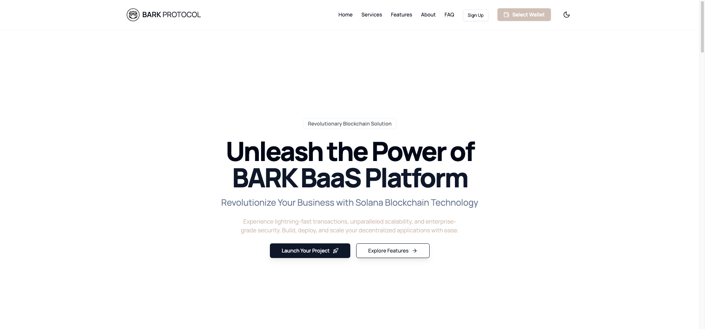
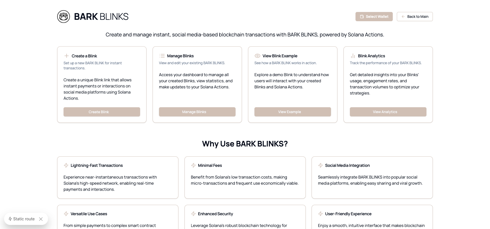
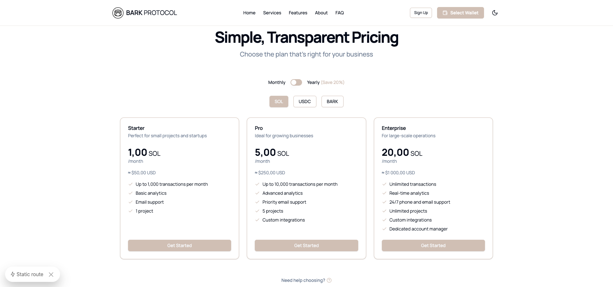

# BARK | Blockchain-as-a-Service (BaaS) Platform
**Proof of Concept**: v0.1.1

## Overview

The **BARK Protocol's Blockchain-as-a-Service (BaaS) Platform** simplifies decentralized application and Solana Blinks development by providing robust tools and services built on the Solana network. It empowers developers to create decentralized applications (dApps) with integrated features like wallet management, blink transactions, token handling, staking mechanisms, and NFT minting.



The platform offers a comprehensive API, user-friendly interface, and payment integration to streamline complex blockchain operations, making dApp deployment and management easier than ever.

## Key Features

- **Solana Blinks**: Create, send, and receive Solana blinks for seamless transactions and interactions to enhance user experience.
- **Blink Transactions**: Streamlined transaction processes to enhance user experience.
- **Commerce**: Built-in support for gift, donation, and crowdfunding functionalities.
- **User & Asset Management**: Efficient management of SPL tokens, including BARK, minting, transferring, and burning.
- **Staking Mechanisms**: Allow users to stake NFTs and tokens and earn rewards.
- **NFT Minting**: Easy creation and management of compressed NFTs (CNFT) on the Solana blockchain.
- **NFT Marketplace**: A dedicated marketplace for users to trade and manage their NFTs.
- **Social Finance**: Tools for community engagement, fundraising, and collaborative financial projects.
- **Wallet Management**: Simplified wallet connections for users with support for popular Solana wallets.
- **Solana login features**: Secure and efficient user authentication using Solana wallets, enabling a seamless login experience for decentralized applications.
- **Governance**: The BARK Governance DAO (Decentralized Autonomous Organization) is a pivotal part of the BARK Protocol ecosystem, empowering BARK token holders to participate in the governance of the platform.

### UI/UX Actions & Blinks







## Tech Stack

The BARK Protocol is built on a modern technology stack designed for scalability, performance, and ease of use:

- **Next.js**
- **TypeScript**
- **React**
- **Tailwind CSS**
- **Solana**
- **Supabase**
- **Anchor**
- **Mantine**
- **Wallet Adapter**
- **Vercel**

### Additional Libraries and Tools

- **express-validator**
- **dotenv**
- **axios**

## Installation

1. Clone the repository:
   ```bash
   git clone https://github.com/barkprotocol/bark-as-a-service.git
   cd bark-protocol
   ```

2. Install dependencies:
   ```bash
   npm install
   ```

3. Set up your environment variables. Create a `.env` file in the root directory and add the following variables:
   ```
   NEXT_PUBLIC_SUPABASE_URL=your_supabase_url
   NEXT_PUBLIC_SUPABASE_ANON_KEY=your_supabase_anon_key
   NEXT_PUBLIC_SOLANA_NETWORK=devnet
   NEXT_PUBLIC_SOLANA_RPC_URL=https://api.devnet.solana.com
   NEXT_PUBLIC_MINT_API_URL=https://api.actions.barkprotocol.net/mint
   TOKEN_PROGRAM_ID=TokenkegQfeZyiNwAJbNbGKPFXkQd5J8X8wnF8MPzYx
   NFT_PROGRAM_ID=gEb7nD9yLkau1P4uyMdke9byJNrat61suH4vYiPUuiR
   DEFAULT_WALLET_ADDRESS=gEb7nD9yLkau1P4uyMdke9byJNrat61suH4vYiPUuiR
   WALLETCONNECT_BRIDGE=https://bridge.walletconnect.org
   METADATA_SERVICE_URL=https://api.example.com/upload-metadata
   ERROR_TRACKING_SERVICE_URL=https://errors.example.com/report
   SECRET_KEY=your-secret-key-here
   JWT_SECRET=your-jwt-secret-key-here
   NODE_ENV=development
   ```

4. Run the development server:
   ```bash
   npm run dev
   ```

## Example Blinks pages

```blinks/

- `index.tsx` handles creating new Blinks
- `blinkboard.tsx` provides an overview of Blinks, donations, and payments
- `page.tsx` serves as a landing page for the Blinks section

### API Documentation

- **BARK Protocol API**: Detailed documentation for all available API endpoints, request/response formats, and examples.
  - [API Documentation Link](https://api.barkprotocol.net/docs)

## References

- **Solana**: Information on the Solana blockchain for interacting with Solana programs.
  - [Solana Documentation](https://docs.solana.com/)

- **Anchor Framework**: A comprehensive guide on using Anchor for Solana smart contract development.
  - [Anchor Documentation](https://www.anchor-lang.com/)

- **Wallet Adapter**: Documentation on the wallet adapter library for integrating various Solana wallets.
  - [Wallet Adapter Documentation](https://github.com/solana-labs/wallet-adapter)

- **Express Validator**: Guide for input validation in Node.js applications using express-validator.
  - [Express Validator Documentation](https://express-validator.github.io/docs/)

- **Tailwind CSS**: Official documentation for the utility-first CSS framework used in the project.
  - [Tailwind CSS Documentation](https://tailwindcss.com/docs)

- **Next.js**: Comprehensive guide to Next.js features and best practices.
  - [Next.js Documentation](https://nextjs.org/docs)

- **Supabase**: Documentation for the open-source Firebase alternative that provides database and authentication services.
  - [Supabase Documentation](https://supabase.com/docs)

- **Mantine**: A React component library that provides prebuilt components and hooks.
  - [Mantine Documentation](https://mantine.dev/docs/getting-started/)

- **Vercel**: Documentation for deploying and hosting your Next.js applications with Vercel.
  - [Vercel Documentation](https://vercel.com/docs)

## Contributing

We welcome contributions! Please fork the repository and submit a pull request for any enhancements or bug fixes.

## License

This project is licensed under the MIT License. See the [LICENSE](LICENSE) file for details.
